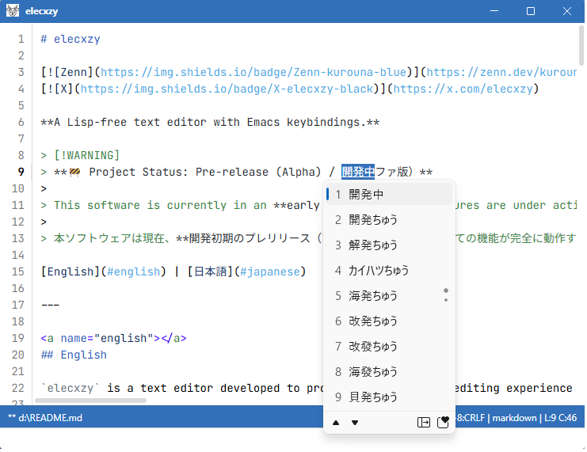

# elecxzy

**A lightweight, Lisp-free text editor with Emacs keybindings.**
Lisp非搭載・設定最小限。迷わず書ける、Emacs操作の軽量エディタ。

  

> [!WARNING]
> **🚧 Project Status: Pre-release (Alpha) / 開発中（アルファ版）**
>
> This software is currently in an **early alpha stage**. Features are under active development, and some functions may be incomplete or unstable. Use with caution.
>
> 本ソフトウェアは現在、**開発初期のプレリリース（アルファ）版**です。すべての機能が完全に動作する状態ではなく、挙動が不安定な場合があります。あらかじめご了承ください。

[English](#english) | [日本語](#japanese)

---

## English

`elecxzy` is a streamlined text editor built from the ground up to provide a vintage Emacs experience within a modern web-technology ecosystem.

Unlike traditional Emacs, **`elecxzy` deliberately omits the Lisp interpreter and complex configuration layers.** This design choice prioritizes raw speed and simplicity—perfect for quick edits without the "configuration bankruptcy".

### 🚀 Key Features

- **Lisp-free & Lightweight**: No heavy script engine overhead. Just the essential text editing features you need.
- **Zero-Config Philosophy**: Minimal customization options mean you can stop tweaking and start coding immediately.
- **Emacs-inspired Workflow**: Familiar keybindings (C-x, M-x, etc.) and command structures for power users.
- **High-Performance Buffer Engine**: Uses a **Piece Table** data structure for efficient handling of large files.
- **Interactive Search & Replace**: Feature-rich `isearch` (incremental search) and `query-replace` for complex text transformations.
- **Living Previews**: Real-time Markdown and HTML preview modes for modern documentation.
- **Dynamic Layout & Window Resizing**: Support for recursive window splitting (vertical/horizontal) with intuitive, Emacs-style size adjustments.
- **Appearance Customization**: Adjust colors for the editor, title bar, and status line via a simple JSON configuration file.
- **Seamless Japanese IME Support**: Optimized for smooth Japanese typing without the common "flicker" or focus issues in web-based editors. (Toggle with `C-\` or `C-]`)

  

### 🛠 Tech Stack

- **Framework**: Electron (Node.js)
- **Frontend**: React, TypeScript
- **Styling**: Vanilla CSS (Simple and distraction-free design)
- **Syntax Highlighting**: Highlight.js integrated

### 📖 Commands

For a full list of available commands and keybindings, please refer to:
👉 **[COMMANDLIST.md](./COMMANDLIST.md)**

### 📥 Downloads

Binaries for Windows are available on the GitHub Releases page.
Source code is currently private.

👉 **[Download the latest version](https://github.com/kurouna/elecxzy/releases)**

---

## 日本語

`elecxzy` は、古典的な Emacs の操作体験を最新の Web 技術（Electron）で再現したテキストエディタです。

本家 Emacs との最大の違いは、**Lispインタプリタや複雑な拡張機能をあえて搭載していない点**です。「設定ファイル（init.el）のメンテナンスに疲れてしまった」「機能は最小限でいいから、あのキー操作でサクサク書きたい」というユーザーのために設計されました。

### 🚀 主な機能

- **Lisp非搭載の軽快さ**: 複雑な処理系を持たないため、起動が速く、動作も軽量です。
- **設定最小限の「即戦力」設計**: カスタマイズの自由度をあえて制限しました。インストール直後から、迷うことなく執筆に集中できます。
- **Emacs風の操作体系**: C-x、M-x、C-s などの慣れ親しんだキーバインドをフルサポート。
- **Piece Tableエンジン**: 大容量ファイルも軽快に扱え、履歴消費が少ない高度なバッファ管理。
- **対話的な検索と置換**: インクリメンタル検索 (isearch) や、一箇所ずつ確認しながら置換できる query-replace を搭載。
- **リアルタイム・プレビュー**: Markdown や HTML の書き換えを即座に確認できるプレビューモード。
- **柔軟な画面分割とリサイズ**: ウィンドウを上下左右に自由に（再帰的に）分割でき、各領域のサイズは Emacs 風のキー操作で直感的にリサイズ可能です。
- **外観のカスタマイズ**: JSON設定ファイルを編集することで、エディタやタイトルバー、ステータスラインの配色を自分好みに変更可能。
- **高精度な日本語IME対応**: Webベースエディタの課題であるIMEの挙動を最適化し、ストレスのない入力を実現。(`C-\` または `C-]` でON/OFF切り替え)

  

### 🛠 技術スタック

- **フレームワーク**: Electron (Node.js)
- **フロントエンド**: React, TypeScript
- **スタイリング**: Vanilla CSS (シンプルで集中しやすいデザイン)
- **シンタックスハイライト**: Highlight.js 搭載

### 📖 操作・コマンド一覧

すべてのコマンドとキーバインドの詳細については、以下を参照してください。
👉 **[COMMANDLIST.md](./COMMANDLIST.md)**

### 📥 ダウンロード

Windows用のバイナリは、GitHubのリリースページからダウンロード可能です。
（ソースコードは現在非公開です）

👉 **[最新版をダウンロードする](https://github.com/kurouna/elecxzy/releases)**

---

## License / ライセンス

This software is released under the [MIT License](./LICENSE). 
本ソフトウェアは [MITライセンス](./LICENSE) のもとで公開されています。

## Acknowledgements / 謝辞

This application is inspired by the legendary editor **xyzzy**:
- **xyzzy**
  - Copyright (c) 1996-2005 Tetsuya Kamei
  - Copyright (c) 2012-2014 xyzzy Project

Special thanks to the original authors for their pioneering work in the Japanese Emacs-like editor ecosystem.