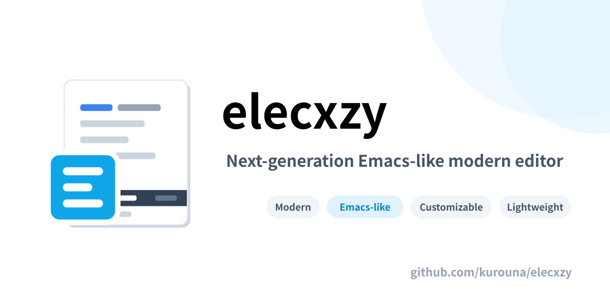
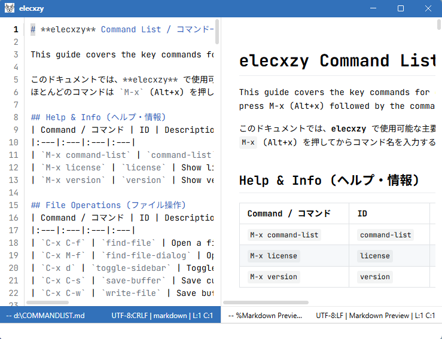
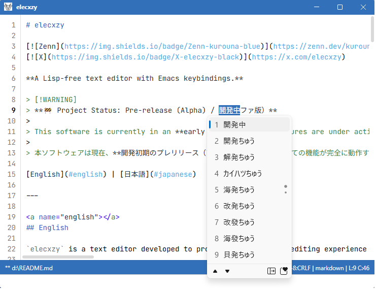
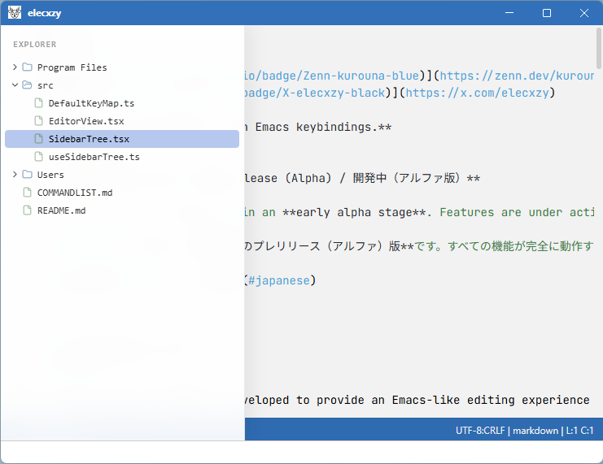

  

**A Lisp-free text editor with Emacs keybindings.**

  

> [!WARNING]
> **🚧 Project Status: Pre-release (Alpha) / 開発中（アルファ版）**
>
> This software is currently in an **early alpha stage**. Features are under active development, and some functions may be incomplete or unstable. Use with caution.
>
> 本ソフトウェアは現在、**開発初期のプレリリース（アルファ）版**です。すべての機能が完全に動作する状態ではなく、挙動が不安定な場合があります。あらかじめご了承ください。

[English](#english) | [日本語](#japanese)

---

## English

`elecxzy` is a text editor developed to provide an Emacs-like editing experience within a web technology stack (Electron). It focuses on maintaining core Emacs workflows and keybindings without an embedded Lisp engine. By providing well-considered default settings out of the box, it reduces the need for extensive initial configuration, allowing you to start editing immediately.

### Architecture & Design

- **Technology Base**: Built on the Electron framework, utilizing HTML and CSS for the user interface, and TypeScript for application logic. It employs IPC communication between the Main and Renderer processes to handle system-level operations.
- **Buffer Management**: Uses an RB-Tree (Red-Black Tree) based Piece Table. This allows efficient operations and incremental, delta-based undo histories for large files.
- **Rendering Engine**: Implements a custom virtual rendering system. It utilizes the Canvas API for accurate text metrics (handling mixed full-width and half-width characters without fixed-width assumptions) and minimizes DOM reflows.
- **IME Input Control**: Implements explicit handling of DOM composition events to manage uncommitted text state and focus. Additionally, it ignores IME input after prefix keys (e.g., `C-x`) to prevent conflicts between Japanese text input and Emacs command execution.
- **Settings System**: Relies on static JSON configurations (`config.json`, `color-config.json`) instead of a dynamic scripting engine.

### Key Features

* **Emacs Keybindings:** Core operations including cursor movement (`C-f`, `C-b`, `C-n`, `C-p`), recursive window splitting (`C-x 2`, `C-x 3`), window resizing (`C-x ^`, `C-x }`), and kill ring management (`C-w`, `M-w`, `C-y`, `M-y`).
* **Search & Replacement:** Incremental search (`C-s`), interactive replacement (`M-%`), and cross-file search across directories (`M-x grep`) powered by background OS processes (`findstr` / `grep`).
* **Completion System:** `dabbrev-expand` (`M-/`) for buffer-local word completion, extracting multi-byte characters and preserving undo chain integrity.
* **Live Preview:** Preview modes for Markdown and HTML, featuring one-way scroll synchronization that tracking the source buffer's position.
* **Window & Buffer Management:** Provides seamless buffer switching (`C-x b`) and a dedicated buffer list (`C-x C-b`). In addition to standard minibuffer prompts, it provides commands to utilize OS-native file and save dialogs (`C-x M-f`, `C-x M-w`).
* **Sidebar File Explorer (Filer):** A dedicated file manager (`C-x d`) displayed on the window's left side. Provides fast file previewing (`l` / `Right`), and directory traversal (`r`, `u`) including support for Windows system drives.
* **Sidebar Utility Suite:** Multiple dedicated sidebars displayed on the window's right side to assist editing:
  * **Outline View** (`C-c o`): Hierarchical display of headings for Markdown and HTML with real-time sync.
  * **Kill Ring Sidebar** (`C-c y` or `M-x browse-kill-ring`): Browse and manage your kill ring (clipboard history).
  * **Register Sidebar** (`C-c r` or `M-x browse-registers`): Inspect and select persistent registers (text and points).
  * **Recent Files Sidebar** (`C-c c` or `M-x browse-recent-files`): Quickly browse and open recently used files with path previews.
  * **Settings Sidebar** (`C-,` or `M-x open-config`): Manage editor configurations like fonts, themes, and line numbers.
* **Terminal Integration:** Built-in interactive shell buffer (`M-x shell`) on Windows environments.
* **Major Modes:** Automatic language detection and syntax highlighting for major languages based on file extensions.
* **Minibuffer Completion:** Interactive completion for `M-x` commands, files, and directories within the minibuffer.
* **File Operations & Encoding:** Includes periodic auto-saving, a recent files list (`M-x recentf-open-files`), automatic UTF-8 promotion, and native buffer printing (`M-x print-buffer`).
* **Text Formatting (Fill Paragraph):** `M-q` (`fill-paragraph`) command to reformat and hard-wrap paragraphs based on a configurable width (`set-wrap-column`), optimizing layout for both Japanese and English text.
* **Persistent Registers:** Store and recall text or cursor positions across sessions using Emacs-style registers. Commands include `C-x r s` (copy to register), `C-x r i` (insert), `C-x r SPC` (save point), and `C-x r j` (jump). All data is persisted in browser local storage.
* **Full Unicode Support:** Robust handling of surrogate pairs (emojis, etc.) throughout the editor, ensuring characters are never split during editing or navigation.
* **Accurate Word Navigation**: Utilizes the native `Intl.Segmenter` API for precise word boundary detection. It provides natural cursor movement (`M-f`, `M-b`, etc.) across CJK (Chinese, Japanese, Korean) text and supports subword navigation (e.g., `snake_case`) out of the box without additional configurations.

  
  
  

### Tech Stack

- **Platform**: Electron
- **Frontend**: React, TypeScript
- **Styling**: Styled-components

### Commands and Customization

For a full list of available commands and keybindings, please refer to:
👉 **[COMMANDLIST.md](./COMMANDLIST.md)**

### Downloads

Binary distributions for Windows are provided via GitHub Releases. The source repository is currently private.

👉 **[Download latest release](https://github.com/kurouna/elecxzy/releases)**

---

## 日本語

`elecxzy` は、Electronを基盤として開発された、Emacsキーバインドをサポートするテキストエディタです。
Lispなどのスクリプトエンジンを含まず、あらかじめ使いやすい設定をデフォルト値として組み込んでおくことで、初期設定のオーバーヘッドを減らし、インストール直後からすぐに作業を開始できることを目的に設計されています。

### アーキテクチャと設計方針

- **基盤技術**: Electronフレームワークをベースとし、UIの構築にHTML/CSS、アプリケーションロジックにTypeScriptを採用しています。メインプロセスとレンダラープロセス間のIPC通信を用いて、ファイルやウィンドウのシステム処理を連携させています。
- **バッファ管理**: 赤黒木（RB-Tree）ベースの Piece Table をデータ構造として採用しています。差分（Delta）を利用したインクリメンタルなUndo履歴の構築により、大容量ファイルにおいてもメモリ使用量を抑えつつ編集操作が可能です。
- **描画エンジン**: 仮想レンダリングによるカスタム描画系を実装しています。Canvas APIを利用した高精度な文字幅計測を組み込むことで、フォントサイズや全角・半角文字の混在に起因するレイアウトのズレを防ぎ、論理的なカーソル配置とスクロール計算を行っています。
- **IME入力制御**: DOMのcompositionイベントを利用して未確定文字の強制確定やフォーカス管理を行っているほか、プリフィックスキー（`C-x`等）の入力直後はIMEの入力を無視する制御を入れることで、Emacsキーバインドと日本語入力の競合を防ぎ、コマンド実行の確実性を向上させています。
- **設定機構**: 動的なスクリプトエンジンを持たず、静的な設定ファイル（`config.json` および `color-config.json`）を用いてエディタの外観や基本的な挙動を管理します。

### 主な機能

* **Emacs互換の操作体系**: 基本的なカーソル移動（`C-n`, `C-a`等）、再帰的なウィンドウの分割と比率変更（`C-x 2`, `C-x ^`等）、キルリングの管理（`C-w`, `M-w`, `C-y`, `M-y`）をサポート。
* **検索・置換機能**: インクリメンタル検索（`C-s`）、対話的置換（`M-%`）、およびバックグラウンドのOSプロセス（Windowsでは `findstr`、他環境では `grep`）を用いたディレクトリ内テキスト検索（`M-x grep`）。
* **動的単語補完**: バッファ近傍の文字列から推測する `dabbrev-expand` (`M-/`)。日本語などのマルチバイト文字の抽出に対応し、Undo履歴管理との連携を維持します。
* **リアルタイムプレビュー**: MarkdownおよびHTMLの編集内容を反映するプレビューモード。ソースバッファのスクロールに連動してプレビュー側もスクロールする片方向スクロール同期を備えています。
* **ウィンドウ・バッファ管理**: バッファの切り替え (`C-x b`) や専用のバッファリスト機能 (`C-x C-b`) を備えるほか、ミニバッファによるファイル操作に加えて、OSネイティブのファイル選択・保存ダイアログ (`C-x M-f`, `C-x M-w`) もサポートします。
* **サイドバー型ファイラ機能**: ウィンドウ左側に表示されるファイルエクスプローラ (`C-x d`)。素早くファイルの中身を確認できるプレビュー機能 (`l` / `Right`) や、Windows環境のシステムドライブにも対応したディレクトリナビゲーション (`r`, `u`) を備えています。
* **右サイドバー機能群:** ウィンドウ右側に表示される、編集を効率化するための各種専用サイドバーを搭載：
  * **アウトラインビュー** (`C-c o`): Markdown/HTMLの見出し階層を表示。エディタとのリアルタイム同期や位置復元に対応。
  * **キルリング・サイドバー** (`C-c y` または `M-x browse-kill-ring`): キルリング（クリップボード履歴）を一覧し、過去のテキストを選択してヤンク（貼り付け）可能。
  * **レジスタ・サイドバー** (`C-c r` または `M-x browse-registers`): 保存されているテキストや位置（レジスタ）を一覧。
  * **最近使ったファイルサイドバー** (`C-c c` または `M-x browse-recent-files`): 最近使用したファイルをディレクトリパスと共に一覧表示し、素早く開くことが可能。
  * **設定サイドバー** (`C-,` または `M-x open-config`): フォント、テーマ、行番号表示などのエディタ設定を視覚的に管理。
* **シェル統合**: エディタ内で対話的シェル（cmd.exe等）を実行するバッファ機能 (`M-x shell`)。
* **メジャーモード**: ファイルの拡張子判定に基づくシンタックスハイライト。
* **ミニバッファ補完**: `M-x` 時のコマンドのほか、ファイルパスやディレクトリパスの補完機能を搭載。
* **ファイル・エンコーディング管理**: オートセーブ、最近開いたファイルの履歴 (`M-x recentf-open-files`)、自動UTF-8昇格、および印刷機能 (`M-x print-buffer`) に対応。
* **段落整形機能 (`M-q`)**: 指定した桁数でテキストをハードラップし、段落を美しく再整形する `fill-paragraph` 機能を搭載。
* **永続化レジスタ機能**: テキストやカーソル位置を一時的に記憶（レジスタ）し、必要な時に呼び出せます。保存内容はローカルストレージへ永続化されます。対応コマンド: `C-x r s` (コピー), `C-x r i` (挿入), `C-x r SPC` (点保存), `C-x r j` (ジャンプ)。
* **サロゲートペアへの完全対応**: 絵文字や特殊漢字などのサロゲートペアを「一文字」として厳格に管理。編集・移動・整形時に文字が分断されることのない堅牢なテキスト処理を実現。
* **正確な単語ナビゲーション**: ネイティブの `Intl.Segmenter` API を利用した単語境界の判定を実装しています。日本語（CJK）における自然な文節移動や、スネークケース（`snake_case`）などのサブワード単位でのカーソル移動（`M-f`, `M-b` など）に標準で対応しています。

  
  
  

### 技術スタック

- **プラットフォーム**: Electron
- **フロントエンド**: React, TypeScript
- **スタイリング**: Styled-components

### コマンド一覧

すべてのコマンドとキーバインドの詳細については、以下をご参照ください。
👉 **[COMMANDLIST.md](./COMMANDLIST.md)**

### ダウンロード

Windows用のバイナリはGitHubのリリースページから取得可能です。（ソースコードは現在非公開です）

👉 **[最新版をダウンロードする](https://github.com/kurouna/elecxzy/releases)**

---

## FAQ

### English

**Q: Is word wrap (wrapping at the window edge) supported?**

A: We currently have no plans to support dynamic word wrap. Implementing line folding requires complex rendering calculations, which would negatively impact the predictability of the virtual rendering system and overall maintainability. As an alternative, please use the **`M-q` (Fill Paragraph)** command to perform hard-wrapping, or enable **`auto-fill-mode`** to automatically insert newlines as you type.

**Q: Horizontal scrolling with my mouse tilt-wheel doesn't work.**

A: Depending on your environment, mouse utility software (e.g., Logi Options) may block horizontal scroll signals (deltaX) for unrecognized applications. You can horizontally scroll by holding the **Shift** key while rotating the vertical wheel.

**Q: The cursor is misaligned when using "MS Gothic" or "MS Mincho" fonts.**

A: This behavior is due to conflicting legacy bitmap data within these older fonts and the modern Canvas-based text measurement. For proper cursor alignment, we recommend using modern monospace fonts such as **BIZ UDGothic**.

### 日本語

**Q: 右端で折り返し表示はできないのですか？**

A: 現時点では、ウィンドウ端での動的な折り返し（ソフトラップ）には対応していません。折り返し処理の実装は、仮想レンダリングにおける座標計算の複雑化を招き、実行速度やコード保守性の低下に繋がるためです。代替手段として、**`M-q` (Fill Paragraph)** コマンドによる整形や、入力に追従して自動的に改行を挿入する **`auto-fill-mode`** をご利用ください。

**Q: マウスのチルトホイールを倒しても水平スクロールが動作しません。**

A: 一部のマウスユーティリティソフト（例：Logi Options）がインストールされている環境では、アプリケーションに対する水平スクロール信号がブロックされる場合があります。**Shiftキーを押しながらホイールを縦に回転**させることで、水平スクロールが可能です。

**Q: 「MS ゴシック」や「MS 明朝」を使うと、カーソルの位置がずれます。**

A: 古いフォントに内蔵されているビットマップ仕様と、Canvas APIを利用した文字幅計測エンジンとの間で生じる挙動です。正確なカーソル配置のためには、表示が滑らかな **BIZ UDGothic** などのモダンな等幅フォントの使用を推奨します。

---

## License / ライセンス

This software is released under the [MIT License](./LICENSE). 
本ソフトウェアは [MITライセンス](./LICENSE) のもとで公開されています。

## Acknowledgements / 謝辞

This application is deeply inspired by the design and philosophy of the following pioneering editors. We express our utmost respect and gratitude to their creators and contributors:

本アプリケーションは、以下の先駆的なエディタの設計と哲学に深くインスパイアされています。これらの優れたソフトウェアを生み出した開発者およびコミュニティの皆様に、最大限の敬意と謝意を表します。

- **GNU Emacs**
  - Copyright (C) 1985-2024 Free Software Foundation, Inc.
  - Created by Richard Stallman

- **xyzzy**
  - Copyright (c) 1996-2005 Tetsuya Kamei
  - Copyright (c) 2012-2014 xyzzy Project
