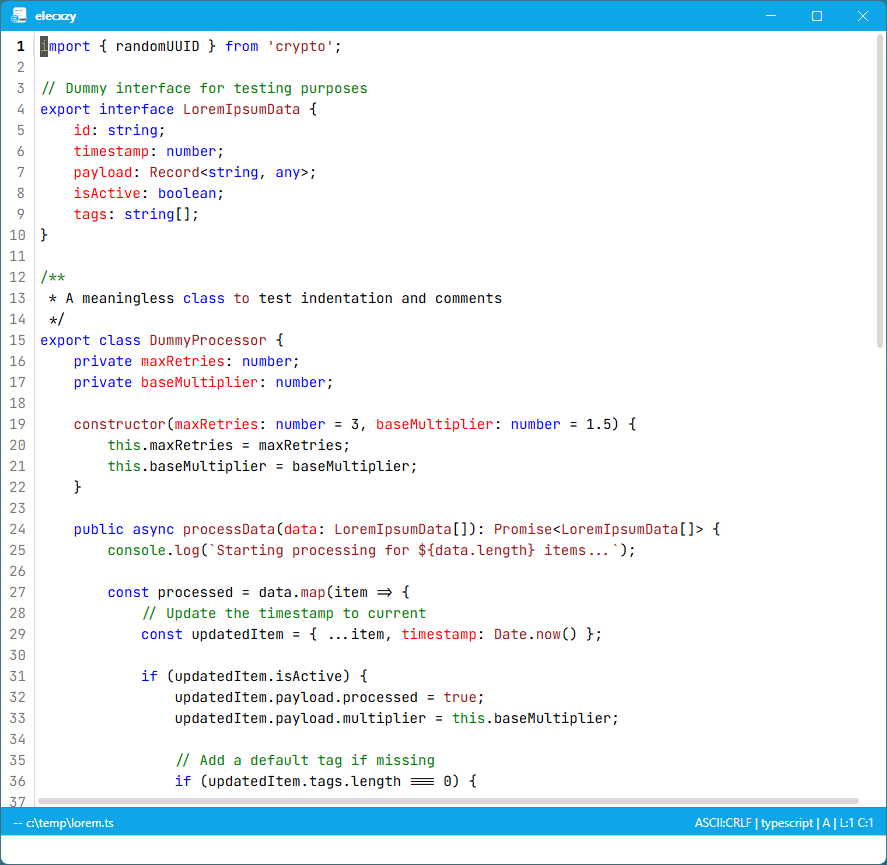
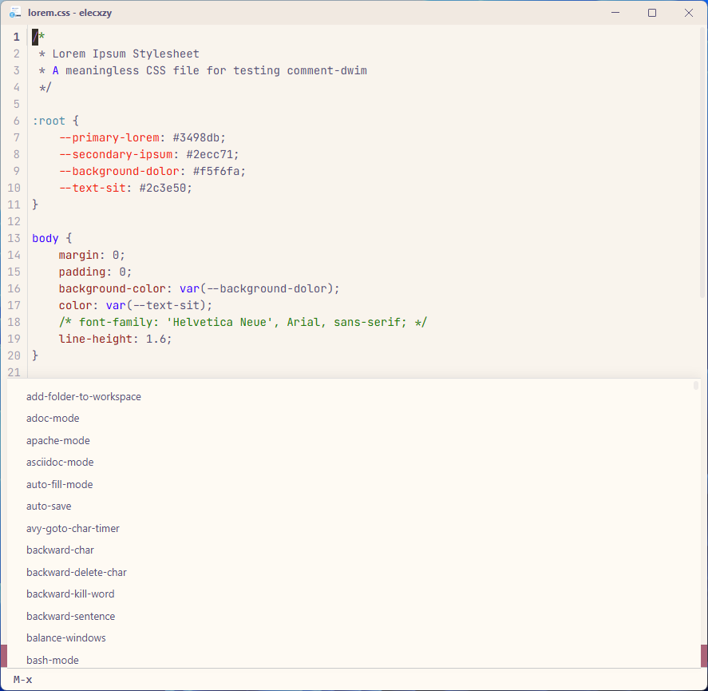
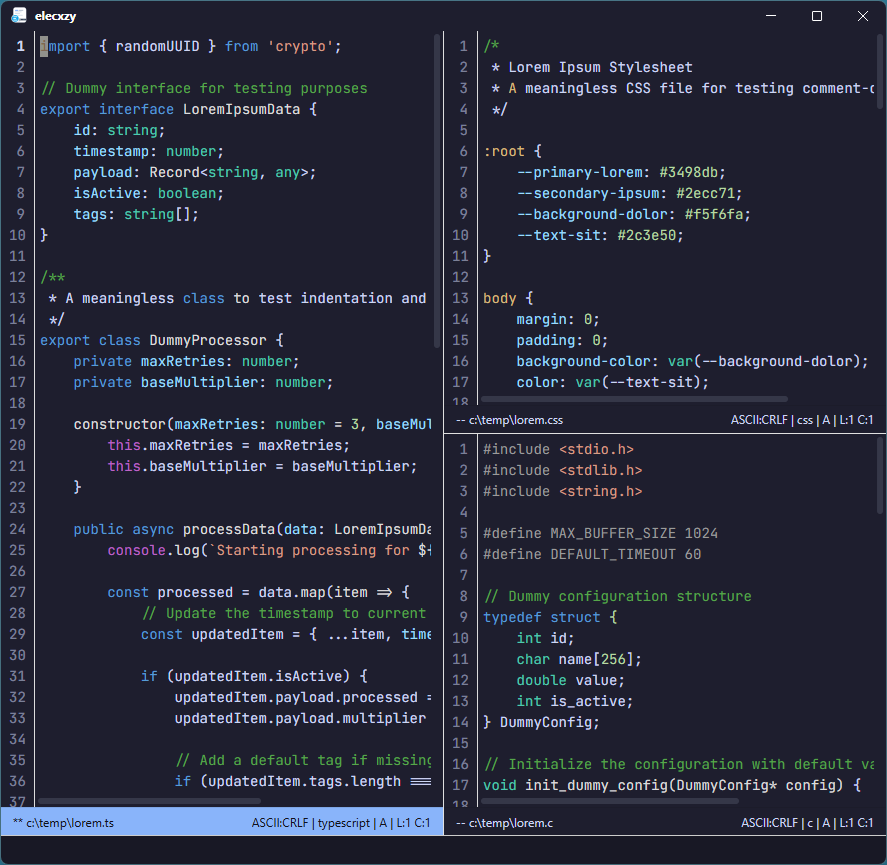
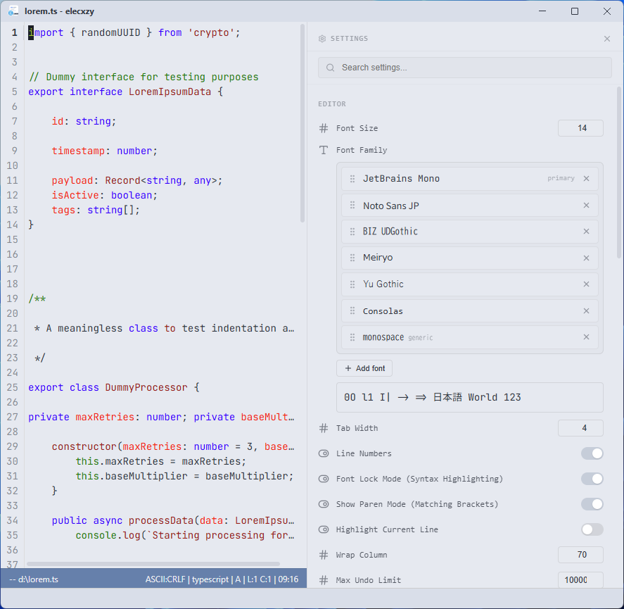
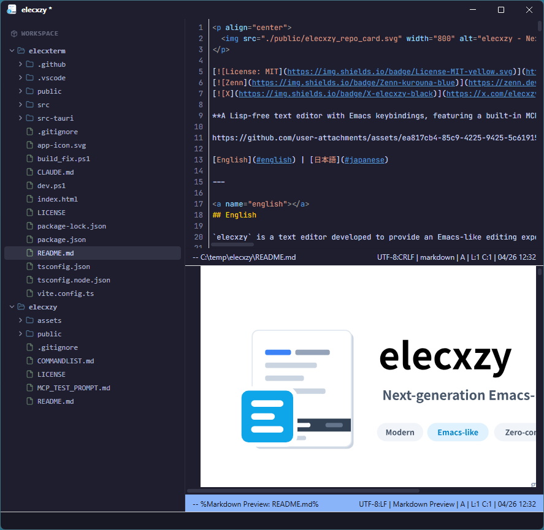
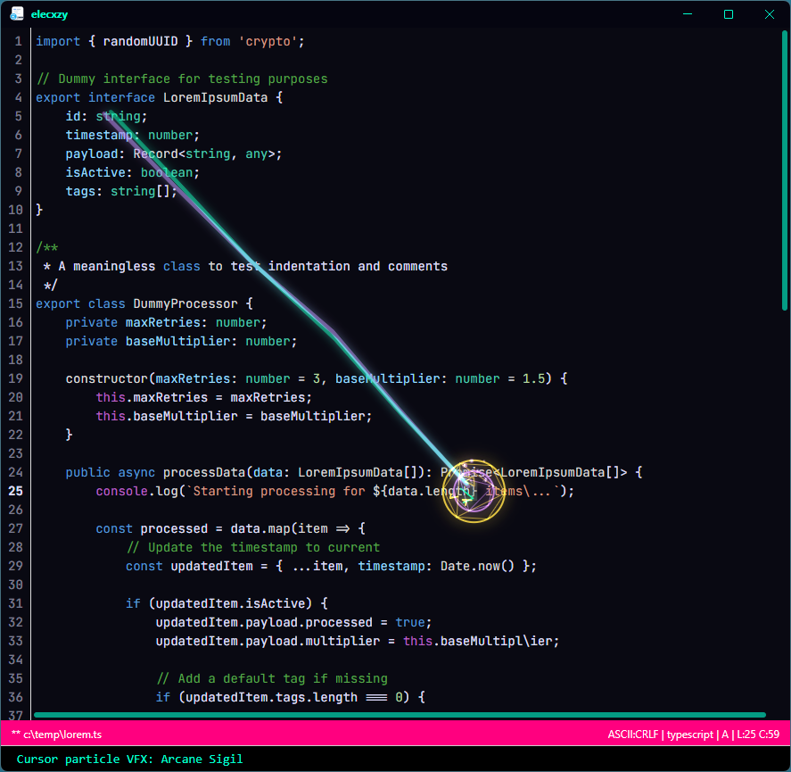
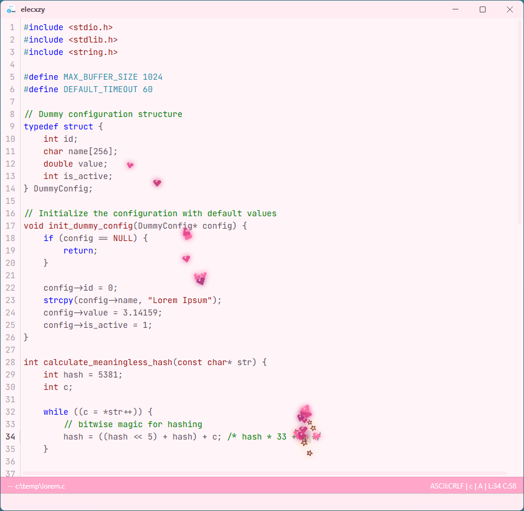
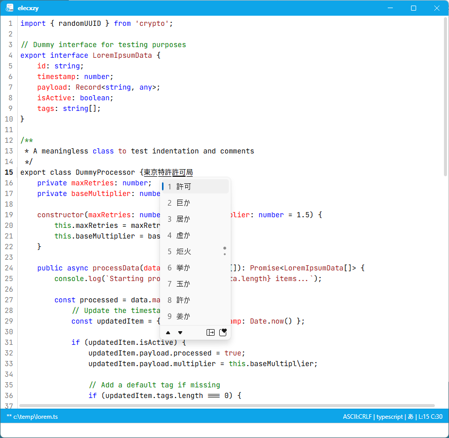

<p align="center">
  
</p>

[](https://opensource.org/licenses/MIT)
[](https://zenn.dev/kurouna)
[](https://x.com/elecxzy)

**A Lisp-free text editor with Emacs keybindings, featuring a built-in MCP server for AI-driven editing.**

https://github.com/user-attachments/assets/ea817cb4-85c9-4225-9425-5c61915823ab

[English](#english) | [日本語](#japanese)

---

<a name="english"></a>
## English

`elecxzy` is a text editor developed to provide an Emacs-like editing experience within a web technology stack (Electron). While it does not include an embedded Lisp engine, it features a built-in MCP (Model Context Protocol) server, enabling AI assistants to directly interact with and control the editor. By providing well-considered default settings out of the box, it reduces the need for extensive initial configuration, allowing you to start editing immediately.

### Download

**Windows only**

[](https://apps.microsoft.com/detail/9P32F2WFL69M)

Automatic updates are provided via the Microsoft Store. For the latest development builds, you can also download binaries from:
👉 **[GitHub Releases](https://github.com/kurouna/elecxzy/releases)**

*Note: The source repository is currently private.*

### Architecture & Design

- **Technology Base**: Built on the Electron framework, utilizing HTML and CSS for the user interface, and TypeScript for application logic. It employs IPC communication between the Main and Renderer processes to handle system-level operations.
- **Buffer Management**: Uses an RB-Tree (Red-Black Tree) based Piece Table. This allows efficient operations and incremental, delta-based undo histories for large files.
- **Rendering Engine**: Implements a custom virtual rendering system. It utilizes the Canvas API for accurate text metrics (handling mixed full-width and half-width characters without fixed-width assumptions) and minimizes DOM reflows.
- **IME Input Control**: Implements explicit handling of DOM composition events to manage uncommitted text state and focus. Additionally, it ignores IME input after prefix keys (e.g., `C-x`) to prevent conflicts between Japanese text input and Emacs command execution.
- **Settings System**: Relies on static JSON configurations (`config.json`, `color-config.json`) instead of a dynamic scripting engine.

### Key Features

* **Emacs Keybindings:** Core operations including cursor movement (`C-f`, `C-b`, `C-n`, `C-p`), recursive window splitting (`C-x 2`, `C-x 3`), window resizing (`C-x ^`, `C-x }`), animated window-layout reshaping (`C-x w t` to transpose, `C-x w f` / `C-x w v` to flip, `C-x w r <Right>` / `<Left>` to rotate the layout 90°, `C-x w o <Right>` / `<Left>` to cycle buffers across panes), and kill ring management (`C-w`, `M-w`, `C-y`, `M-y`).
* **Search & Replacement:** Incremental search (`C-s`), interactive replacement (`M-%`), and cross-file search across directories (`M-x grep`) powered by background OS processes (`findstr` / `grep`).
* **Completion System:** `dabbrev-expand` (`M-/`) for buffer-local word completion, extracting multi-byte characters and preserving undo chain integrity.
* **Live Preview:** Preview modes for Markdown, HTML, and plain text (with word-wrap at the window edge for text), featuring one-way scroll synchronization that tracking the source buffer's position.
* **Window & Buffer Management:** Provides seamless buffer switching (`C-x b`) and a dedicated buffer list (`C-x C-b`). In addition to standard minibuffer prompts, it provides commands to utilize OS-native file and save dialogs (`C-x M-f`, `C-x M-w`).
* **Sidebar File Explorer (Filer):** A dedicated file manager (`C-x d` / `C-c d`) displayed on the window's left side. Provides fast file previewing (`l` / `Right`), and directory traversal (`r`, `u`) including support for Windows system drives.
* **Sidebar Utility Suite:** Multiple dedicated sidebars displayed on the window's right side to assist editing:
  * **Workspace Sidebar** (`C-c w`, `C-,` or `M-x toggle-workspace-sidebar`): Manage multiple folders in a dedicated workspace, seamlessly opening and saving `.code-workspace` files compatible with VS Code.
  * **Outline View** (`C-c o`): Hierarchical display of headings for Markdown and HTML with real-time sync.
  * **Kill Ring Sidebar** (`C-c y` or `M-x browse-kill-ring`): Browse and manage your kill ring (clipboard history).
  * **Register Sidebar** (`C-c r` or `M-x browse-registers`): Inspect and select persistent registers (text, points, and window layouts).
  * **Undo History Sidebar** (`C-c u` or `M-x browse-undo-history`): Browse the active buffer's undo history with text previews; selecting an entry rolls the buffer back to that point and is recorded as a single redo transaction (Office-style).
  * **Playback History** (`M-x playback-history`): Animate the buffer's edit history — rewind to the oldest state and step-by-step redo back to the current state. Prefix arguments control the speed (`C-u` = 10ms, `C-u C-u` = 1ms, `C-u <n>` = `<n>` ms, max 1000ms). Press any key or click to abort, which jumps directly to the latest state. A read-only guard protects the buffer from auto-save, MCP writes, and external drag-and-drop during animation, so intermediate states are never persisted to disk.
  * **Recent Files Sidebar** (`C-c c` or `M-x browse-recent-files`): Quickly browse and open recently used files with path previews. Press `m` to pin / unpin a focused file.
  * **Bookmark Sidebar** (`C-c b` / `C-x r l` or `M-x browse-bookmarks`): Pin files for long-term quick access. Press `m` on any file in Recent Files / Filer / Workspace sidebars to add it to bookmarks; press `m` inside the Bookmark Sidebar to remove. Bookmarks are persisted in `config.json`. Use `C-x r m` (`bookmark-set`) to pin the currently open file (no-op with a message if it is already bookmarked), or `M-x bookmark-toggle` to toggle it. Keybindings follow Emacs `bookmark.el` conventions.
  * **Settings Sidebar** (`C-c s`, `C-.` or `M-x open-config`): Manage editor configurations like fonts, themes, and line numbers.
  * **Git Sidebar** (`C-c g` or `M-x toggle-git-sidebar`): A Source Control view for the open workspace. Lists changed files per repository and a commit history graph; press `Enter` on a changed file to show its `git diff HEAD` in a read-only `*git-diff*` buffer, or expand a commit to inspect its changes. Commit all changes from the built-in message box (`Ctrl+Enter`, or `Ctrl+Shift+Enter` to commit & push in one step), and push / pull (`P` / `F`) without leaving the editor. Branches with no upstream are published via `git push -u origin` (like VS Code), while branches that already track an upstream use a standard push. Create a lightweight tag at HEAD from the message box text and push all tags to the remote with the Create Tag / Push Tags buttons (`t` / `T`).
* **Terminal Integration:** Built-in interactive shell buffer (`M-x shell`) on Windows environments.
* **Major Modes:** Automatic language detection and syntax highlighting for major languages based on file extensions.
* **Minibuffer Completion:** Interactive completion for `M-x` commands, files, and directories within the minibuffer.
* **Non-text File Import:** Automatically extract and import plain text from PDF, Word documents (**`.docx`**), and Excel (**`.xlsx`**) files. Excel documents are parsed with sheet headers and data formatted in a clean TSV (Tab-Separated Values) layout. **Note:** Imported files are opened in **Read-only mode** to prevent overwriting the original binary data. Use 'Save As' (`C-x C-w` or `C-x M-w`) to save the extracted text to a new file. A **50MB size limit** applies to these formats to ensure system stability.
* **File Operations & Encoding:** Includes periodic auto-saving, a recent files list (`M-x recentf-open-files`), automatic UTF-8 promotion, and native buffer printing (`M-x print-buffer`).
* **Text Formatting (Fill Paragraph):** `M-q` (`fill-paragraph`) command to reformat and hard-wrap paragraphs based on a configurable width (`set-wrap-column`), optimizing layout for both Japanese and English text.
* **Persistent Registers:** Store and recall text, cursor positions, or **window layouts** across sessions using Emacs-style registers. Commands include `C-x r s` (copy to register), `C-x r i` (insert), `C-x r SPC` (save point), `C-x r j` (jump / restore layout), and `C-x r w` (save window layout). All data is persisted in browser local storage. Supports special 'rectangle' type storage when in rectangle mark mode.
* **Rectangle Editing:** Enhanced rectangle support for mass-editing columns. Enter rectangle mark mode with `C-x SPC`, and perform operations like `C-x r k` (kill), `M-x kill-ring-save` (copy), and `C-y` (yank). The editor intelligently detects rectangular data in the kill ring and registers.
* **Full Unicode Support:** Robust handling of surrogate pairs (emojis, etc.) throughout the editor, ensuring characters are never split during editing or navigation.
* **Accurate Word Navigation**: Utilizes the native `Intl.Segmenter` API for precise word boundary detection. It provides natural cursor movement (`M-f`, `M-b`, etc.) across CJK (Chinese, Japanese, Korean) text and supports subword navigation (e.g., `snake_case`) out of the box without additional configurations.
* **Avy Jump Navigation (`C-'`):** Quick cursor movement within the visible viewport using target labels. Press `C-'` followed by a character to overlay matching locations with labels, then type the label to jump.
* **Cursor Visual Effects (VFX):** Add dynamic visual flair to your cursor movement. Switch between 9 unique styles (including "Light Particle", "Cyber Trace", and "Kawaii Shower"), plus the caret-following cat mascot "Elenyan", or turn it off:
  * `C-c 1` to `C-c 9`: Switch through different VFX styles.
  * `C-c 0`: Turn VFX off.
  * `M-x set-cursor-vfx`: Select any style, including the "Elenyan" cat mascot (`C-u N` picks one of 3 cats).
* **Lightweight Cursor-based Macros (Beta):** Reproduce repetitive text mutations (`insert`/`delete`) relative to the cursor position (`C-x (`, `C-x )`, `C-x e`). Supports prefix arguments for repetition (e.g., `C-u 10 C-x e`).
* **Customizable Color Themes:** Personalize your workspace with 10 built-in themes (balanced 5 light / 5 dark) — **"Dark"** / **"Light"** (Catppuccin), **"Cyber"** (Neon/Futuristic), **"Cute"** (Pastel/Macaron), **"Tokyo Night"** (Storm Navy + Neon Cyan), **"Rose Pine Dawn"** (Warm Paper), **"Gruvbox"** (Retro Warm), **"Nord"** (Arctic Snow Light), **"Forest"** (Everforest Green), and **"Default"** — switchable via `M-x <theme-name>-theme`.
* **MCP Server Integration**: Functions as a Model Context Protocol (MCP) server, allowing AI assistants (Google Antigravity, Claude Desktop/Code, etc.) to read/edit buffers and control the editor directly via the **`ELECXZY_MCP_MODE`** environment variable.
* **TypeScript Plugins:** Add your own `M-x` commands by dropping a `.ts` file into the `plugins` folder next to `config.json`. A plugin default-exports `{ command, description, execute(input) }` and runs in an isolated, network-blocked Web Worker with a configurable timeout (`M-x set-plugin-timeout`). See the **Plugins** section below.
* **Custom Keybindings (`keybinds.json`)**: Override or remove default keybindings without rebuilding. Drop a `keybinds.json` next to `config.json` (open it any time with `M-x show-keybinds-config`); Emacs-style notation is supported (`\C-` = Ctrl, `\M-` = Alt, space-separated tokens form a key sequence like `"C-x C-f"`), and an empty string value removes a binding. Function keys `F1`–`F12` can also be bound (e.g. `"F5": "revert-buffer"`, `"C-F12": "save-buffer"`); when unbound, the Electron default `F11` full-screen toggle is preserved. Parsing or validation problems are reported once in the echo line and never crash editing. Example:
  ```json
  {
      "\\C-s": "save-buffer",
      "C-x C-r": "mark-whole-buffer",
      "F5": "revert-buffer",
      "\\C-_": ""
  }
  ```

<p align="center">
  
  
  
  
  
  
  
</p>

### MCP Server Integration

`elecxzy` can function as an MCP server. By connecting your AI assistant to `elecxzy`, the AI can gain direct access to your open buffers, layout, and editing commands. This allows for powerful AI-driven editing workflows.

> [!IMPORTANT]
> Before starting the MCP server, configure **Allowed Save Directories** in `Settings → MCP` (or `mcpAllowedDirectories` in `config.json`). The MCP `save_file` tool can only write to paths under one of these directories. `M-x mcp-start` aborts with an echo-line message if the list is empty or contains a non-existent path.

#### Configuration (Google Antigravity / Claude Desktop / Claude Code)

Add the following to your `claude_desktop_config.json` or the relevant configuration section of your AI agent (like Google Antigravity), referring to one of the examples below:

```json
{
  "mcpServers": {
    "elecxzy": {
      "command": "C:\\path\\to\\elecxzy\\elecxzy.exe",
      "args": ["C:\\path\\to\\elecxzy\\resources\\app.asar"],
      "env": {
        "ELECXZY_MCP_MODE": "true",
        "ELECTRON_RUN_AS_NODE": "1"
      }
    }
  }
}
```

```json
{
  "mcpServers": {
    "elecxzy": {
      "command": "C:\\Users\\...\\AppData\\Local\\Programs\\elecxzy\\elecxzy.exe",
      "args": ["C:\\Users\\...\\AppData\\Local\\Programs\\elecxzy\\resources\\app.asar"],
      "env": {
        "ELECXZY_MCP_MODE": "true",
        "ELECTRON_RUN_AS_NODE": "1"
      }
    }
  }
}
```

### Plugins

`elecxzy` supports small, sandboxed TypeScript plugins. Drop a `.ts` file into the `plugins` folder (in the same user-data folder as `config.json`; open it with `M-x open-plugins-folder`) and it registers a new `M-x` command. On first run the folder is created with a type-definition file (`elecxzy-plugin.d.ts`) and a `hello-world.ts` sample.

A plugin is a single file that default-exports `{ command, description, execute(input) }`. `execute` receives a snapshot of the active buffer and returns how to change it — for example, an upcase command:

```ts
import type { Plugin } from './elecxzy-plugin'

const plugin: Plugin = {
  command: 'upcase-buffer',
  description: 'Uppercase the region, or the whole buffer',
  execute(input) {
    if (input.selection) {
      const { start, length } = input.selection
      const region = input.text.slice(start, start + length)
      return { text: region.toUpperCase(), start, length }
    }
    return input.text.toUpperCase() // a bare string replaces the whole buffer
  },
}

export default plugin
```

`input` provides `text` (the whole buffer), `cursor`, `selection` (`{ start, length }` or `null`), `fileName`, and `language`. The return value can be a **string** (replace the whole buffer), an **object** `{ text, start?, length?, cursor?, select?, message? }` (a ranged edit — `start`+`length` splice, both omitted = whole buffer — and/or a one-line message shown as `[command] …`), `{ message }` (message only), or `null` (do nothing). A plugin may also declare an optional `apiVersion: 1`; plugins declaring a newer API version than this build supports are skipped at load.

Plugins run in an isolated Web Worker: no Node, no DOM, no filesystem access, and the network is blocked by the app's Content-Security-Policy. A run that exceeds the timeout (`M-x set-plugin-timeout` or `pluginTimeout` in `config.json`; 1–60 seconds, default 5) is aborted, so a buggy plugin can never freeze the editor. Turn the whole system on/off with `M-x toggle-plugins` (or `enablePlugins` in `config.json`), and reload after editing files with `M-x reload-plugins`. When a plugin does not load or behaves unexpectedly, `M-x debug-plugins` reloads everything and opens a read-only `*Plugin Report*` buffer with the per-file outcome — including full compile errors that do not fit in the echo line.

### Tech Stack

- **Platform**: Electron
- **Frontend**: React, TypeScript
- **Styling**: Styled-components

### Commands and Customization

For a full list of available commands and keybindings, please refer to:
👉 **[COMMANDLIST.md](./COMMANDLIST.md)**

---

<a name="japanese"></a>
## 日本語

`elecxzy` は、Electronを基盤として開発された、Emacsキーバインドをサポートするテキストエディタです。
Lispなどのスクリプトエンジンは内蔵していませんが、テキスト編集機能を提供するMCP（Model Context Protocol）サーバー機能を備えており、各種AIアシスタントから直接エディタを操作することが可能です。
あらかじめ使いやすい設定をデフォルト値として組み込んでおくことで、初期設定のオーバーヘッドを減らし、インストール直後からすぐに作業を開始できることを目的に設計されています。

### ダウンロード

**Windows専用**

[](https://apps.microsoft.com/detail/9P32F2WFL69M)

Microsoft Store版は、自動更新が提供されます。最新の開発版（GitHub経由）は以下から入手可能です：
👉 **[GitHub Releases](https://github.com/kurouna/elecxzy/releases)**

*※ソースコードは現在非公開です。*

### アーキテクチャと設計方針

- **基盤技術**: Electronフレームワークをベースとし、UIの構築にHTML/CSS、アプリケーションロジックにTypeScriptを採用しています。メインプロセスとレンダラープロセス間のIPC通信を用いて、ファイルやウィンドウのシステム処理を連携させています。
- **バッファ管理**: 赤黒木（RB-Tree）ベースの Piece Table をデータ構造として採用しています。差分（Delta）を利用したインクリメンタルなUndo履歴の構築により、大容量ファイルにおいてもメモリ使用量を抑えつつ編集操作が可能です。
- **描画エンジン**: 仮想レンダリングによるカスタム描画系を実装しています。Canvas APIを利用した高精度な文字幅計測を組み込むことで、フォントサイズや全角・半角文字の混在に起因するレイアウトのズレを防ぎ、論理的なカーソル配置とスクロール計算を行っています。
- **IME入力制御**: DOMのcompositionイベントを利用して未確定文字の強制確定やフォーカス管理を行っているほか、プリフィックスキー（`C-x`等）の入力直後はIMEの入力を無視する制御を入れることで、Emacsキーバインドと日本語入力の競合を防ぎ、コマンド実行の確実性を向上させています。
- **設定機構**: 動的なスクリプトエンジンを持たず、静的な設定ファイル（`config.json` および `color-config.json`）を用いてエディタの外観や基本的な挙動を管理します。

### 主な機能

* **Emacs互換の操作体系**: 基本的なカーソル移動（`C-n`, `C-a`等）、再帰的なウィンドウの分割と比率変更（`C-x 2`, `C-x ^`等）、ウィンドウレイアウトのアニメーション付き再構成（`C-x w t` で転置、`C-x w f` / `C-x w v` で左右・上下反転、`C-x w r <Right>` / `<Left>` でレイアウト 90° 回転、`C-x w o <Right>` / `<Left>` でペイン間バッファ循環シフト）、キルリングの管理（`C-w`, `M-w`, `C-y`, `M-y`）をサポート。
* **検索・置換機能**: インクリメンタル検索（`C-s`）、対話的置換（`M-%`）、およびバックグラウンドのOSプロセス（Windowsでは `findstr`、他環境では `grep`）を用いたディレクトリ内テキスト検索（`M-x grep`）。
* **動的単語補完**: バッファ近傍の文字列から推測する `dabbrev-expand` (`M-/`)。日本語などのマルチバイト文字の抽出に対応し、Undo履歴管理との連携を維持します。
* **リアルタイムプレビュー**: Markdown / HTML / プレーンテキストの編集内容を反映するプレビューモード（テキストはウィンドウ幅で折り返して表示）。ソースバッファのスクロールに連動してプレビュー側もスクロールする片方向スクロール同期を備えています。
* **ウィンドウ・バッファ管理**: バッファの切り替え (`C-x b`) や専用のバッファリスト機能 (`C-x C-b`) を備えるほか、ミニバッファによるファイル操作に加えて、OSネイティブのファイル選択・保存ダイアログ (`C-x M-f`, `C-x M-w`) もサポートします。
* **サイドバー型ファイラ機能**: ウィンドウ左側に表示されるファイルエクスプローラ (`C-x d` / `C-c d`)。素早くファイルの中身を確認できるプレビュー機能 (`l` / `Right`) や、Windows環境のシステムドライブにも対応したディレクトリナビゲーション (`r`, `u`) を備えています。
* **右サイドバー機能群:** ウィンドウ右側に表示される、編集を効率化するための各種専用サイドバーを搭載：
  * **ワークスペース・サイドバー** (`C-c w`, `C-,` または `M-x toggle-workspace-sidebar`): 複数のフォルダをまとめて管理。VS Code互換の `.code-workspace` ファイルの読み書きに対応しています。
  * **アウトラインビュー** (`C-c o`): Markdown/HTMLの見出し階層を表示。エディタとのリアルタイム同期や位置復元に対応。
  * **キルリング・サイドバー** (`C-c y` または `M-x browse-kill-ring`): キルリング（クリップボード履歴）を一覧し、過去のテキストを選択してヤンク（貼り付け）可能。
  * **レジスタ・サイドバー** (`C-c r` または `M-x browse-registers`): 保存されているテキスト、位置、ウィンドウレイアウト（レジスタ）を一覧。
  * **Undo 履歴サイドバー** (`C-c u` または `M-x browse-undo-history`): 現在のバッファの Undo 履歴を中身付きで一覧表示し、選択した項目までまとめて Undo できます。サイドバー経由のまとめ Undo は 1 回の Redo で一括復元できます（Word/Excel と同様）。
  * **履歴プレイバック** (`M-x playback-history`): 現在のバッファの編集履歴をアニメーション再生します。先頭まで一気に Undo した後、現在の状態まで段階的に Redo して再生します。プレフィックス引数で速度を制御可能 (`C-u` で 10ms、`C-u C-u` で 1ms、`C-u <n>` で `<n>` ms、上限 1000ms)。任意のキー入力やクリックで中断（最新状態に即座に復帰）。再生中はバッファに読み取り専用ガードがかかり、オートセーブ、MCP からの書き込み、外部ファイルのドラッグ&ドロップが中間状態をディスクに保存しないよう保護されます。
  * **最近使ったファイルサイドバー** (`C-c c` または `M-x browse-recent-files`): 最近使用したファイルをディレクトリパスと共に一覧表示し、素早く開くことが可能。フォーカス中の行で `m` キーを押すとブックマーク (ピン止め) のトグルが可能。
  * **ブックマーク サイドバー** (`C-c b` / `C-x r l` または `M-x browse-bookmarks`): よく使うファイルをピン止めして長期的に呼び出せるサイドバー。最近使ったファイル / ファイラ / ワークスペース サイドバー上で `m` キーを押すとブックマーク追加、ブックマーク サイドバー内で `m` キーを押すと解除できます。`config.json` に永続化されます。`C-x r m` (`bookmark-set`) で現在開いているファイルをブックマーク (既にブックマーク済みの場合はミニバッファに通知)、`M-x bookmark-toggle` でトグルできます。キーバインドは Emacs `bookmark.el` の規約に準拠しています。
  * **設定サイドバー** (`C-c s`, `C-.` または `M-x open-config`): フォント、テーマ、行番号表示などのエディタ設定を視覚的に管理。
  * **Git サイドバー** (`C-c g` または `M-x toggle-git-sidebar`): 開いているワークスペースのソース管理ビュー。リポジトリごとの変更ファイル一覧とコミット履歴グラフを表示します。変更ファイルで `Enter` を押すと `git diff HEAD` の差分を読み取り専用の `*git-diff*` バッファに表示し、コミットを展開してその変更内容を確認できます。内蔵のメッセージ欄から全変更を一括コミット（`Ctrl+Enter`、`Ctrl+Shift+Enter` でコミット＆push を一括）、push / pull（`P` / `F`）までエディタ内で完結できます。upstream 未設定のブランチは VS Code 同様 `git push -u origin` で publish し、既に upstream を追跡しているブランチは通常の push になります。Create Tag / Push Tags ボタン（`t` / `T`）で、メッセージ欄のテキストを名前にした軽量タグを HEAD に作成し、すべてのタグをリモートへ push できます。
* **シェル統合**: エディタ内で対話的シェル（cmd.exe等）を実行するバッファ機能 (`M-x shell`)。
* **メジャーモード**: ファイルの拡張子判定に基づくシンタックスハイライト。
* **ミニバッファ補完**: `M-x` 時のコマンドのほか、ファイルパスやディレクトリパスの補完機能を搭載。
* **ドキュメント・インポーター**: PDF、Word (**`.docx`**)、Excel (**`.xlsx`**) 形式のファイルを、プレーンテキストとして自動的に抽出・インポートして開くことが可能です。Excel は各シートが TSV 形式で読み込まれます。**注意:** 元のバイナリファイルを破壊しないよう、インポートされたバッファは自動的に**「読み取り専用（Read-only）」**として開かれます（安定性確保のため、**50MBまでのサイズ制限**があります）。抽出したテキストを保存する場合は `Save As` (`C-x C-w`または`C-x M-w`) を使用してください。
* **ファイル・エンコーディング管理**: オートセーブ、最近開いたファイルの履歴 (`M-x recentf-open-files`)、自動UTF-8昇格、および印刷機能 (`M-x print-buffer`) に対応。
* **段落整形機能 (`M-q`)**: 指定した桁数でテキストをハードラップし、段落を美しく再整形する `fill-paragraph` 機能を搭載。
* **永続化レジスタ機能**: テキスト、カーソル位置、**ウィンドウレイアウト**を一時的に記憶（レジスタ）し、必要な時に呼び出せます。保存内容はローカルストレージへ永続化されます。対応コマンド: `C-x r s` (コピー), `C-x r i` (挿入), `C-x r SPC` (点保存), `C-x r j` (ジャンプ / レイアウト復元), `C-x r w` (ウィンドウレイアウト保存)。矩形選択モード中であれば矩形データとしても保存可能です。
* **矩形編集機能**: 縦方向にテキストを操作する矩形編集を正式にサポート。`C-x SPC` で矩形マークモードに入り、`C-x r k` (切り取り) やヤンク (C-y) が可能です。キルリングやレジスタに保存された矩形データは、貼り付け時に自動的に判別・展開されます。
* **サロゲートペアへの完全対応**: 絵文字や特殊漢字などのサロゲートペアを「一文字」として厳格に管理。編集・移動・整形時に文字が分断されることのない堅牢なテキスト処理を実現。
* **正確な単語ナビゲーション**: ネイティブの `Intl.Segmenter` API を利用した単語境界の判定を実装しています。日本語（CJK）における自然な文節移動や、スネークケース（`snake_case`）などのサブワード単位でのカーソル移動（`M-f`, `M-b` など）に標準で対応しています。
* **Avy ジャンプ (`C-'`):** 画面内の表示領域に対して、ラベル入力を用いたカーソル移動。`C-'` に続けて文字を入力すると座標にラベルが重畳表示され、それをタイピングすることで目的の場所へ即座にジャンプできます。
* **カーソルVFX:** カーソルの移動に合わせて動的な視覚効果（粒子、雷、カワイイシャワー、分身など）を表示します。ショートカットキーで9種類のスタイルを瞬時に切り替えられるほか、カーソルを追う猫マスコット「Elenyan」も選べます。
  * `C-c 1` 〜 `C-c 9`: 各種VFXスタイルを選択。
  * `C-c 0`: VFXをオフにします。
  * `M-x set-cursor-vfx`: 任意のスタイルを選択。猫マスコット「Elenyan」もここから選べます（`C-u N` で3種類の猫を選択）。
* **簡易的なカーソルベースマクロ (Beta):** カーソル位置を基準としたテキスト操作（挿入・削除）を記録・再現します（`C-x (`, `C-x )`, `C-x e`）。ユニバーサル引数による連続実行（`C-u 10 C-x e` 等）にも対応しています。
* **カスタマイズ可能なカラーテーマ:** 10 種類の内蔵テーマ (ライト 5 / ダーク 5 のバランス構成) で作業空間をパーソナライズできます。**"Dark"** / **"Light"** (Catppuccin)、**"Cyber"** (ネオン/近未来)、**"Cute"** (パステル/マカロン)、**"Tokyo Night"** (Storm 濃紺 + ネオンシアン)、**"Rose Pine Dawn"** (温かい紙)、**"Gruvbox"** (レトロ暖色)、**"Nord"** (北極の雪原ライト)、**"Forest"** (Everforest グリーン)、**"Default"** を `M-x <テーマ名>-theme` で切り替え可能です。
* **MCP サーバー統合**: Model Context Protocol (MCP) サーバーとして動作可能。環境変数 **`ELECXZY_MCP_MODE`** を **`true`** に指定して起動することで、AI アシスタント（Google Antigravity, Claude Desktop/Code 等）から直接バッファの読み書きやエディタ操作が行えます。
* **TypeScript プラグイン:** `config.json` と同じフォルダの `plugins` フォルダに `.ts` ファイルを置くだけで、独自の `M-x` コマンドを追加できます。プラグインは `{ command, description, execute(input) }` を default export し、隔離され通信が遮断された Web Worker 内でタイムアウト付き (`M-x set-plugin-timeout`) で実行されます。詳細は下記「プラグイン」を参照。
* **キーバインドのカスタマイズ (`keybinds.json`)**: 再ビルドなしに既定キーマップを上書き・削除できます。`config.json` と同じユーザデータフォルダに `keybinds.json` を置くだけ（`M-x show-keybinds-config` でいつでも開けます）。記法は Emacs 互換で、`\C-` が `Ctrl`、`\M-` が `Alt`、スペース区切りでキーシーケンス（`"C-x C-f"`）を表現できます。値を空文字 `""` にするとそのバインドを削除します。ファンクションキー `F1`〜`F12` も割り当て可能です（例: `"F5": "revert-buffer"`、`"C-F12": "save-buffer"`）。未割当のままなら Electron 既定の `F11` 全画面トグルはそのまま動作します。JSON の構文エラーや未登録コマンド ID などはエコーラインに 1 度だけまとめて表示され、起動・編集を止めることはありません。例:
  ```json
  {
      "\\C-s": "save-buffer",
      "C-x C-r": "mark-whole-buffer",
      "F5": "revert-buffer",
      "\\C-_": ""
  }
  ```

<p align="center">
  
  
  
  
  
  
  
</p>


### MCP サーバー統合

`elecxzy` は MCP サーバーとして動作します。お使いの AI アシスタント（Google Antigravity や Claude Desktop/Code 等）と連携させることで、AI が開いているバッファの内容を読み取ったり、直接編集したりといった強力なエージェント操作が可能になります。

> [!IMPORTANT]
> MCP サーバーを起動する前に、`設定サイドバー → MCP` の **Allowed Save Directories**（または `config.json` の `mcpAllowedDirectories`）に保存を許可するディレクトリを登録してください。MCP の `save_file` ツールは、登録されたいずれかのディレクトリ配下にしか書き込めません。リストが空、または存在しないパスを含む場合、`M-x mcp-start` は起動を中断し、エコーラインに案内を表示します。

#### 設定方法 (Google Antigravity / Claude Desktop / Claude Code)

`claude_desktop_config.json` や、Google Antigravity の設定セクションに以下のいずれかの内容を参考にして追加してください：

```json
{
  "mcpServers": {
    "elecxzy": {
      "command": "C:\\path\\to\\elecxzy\\elecxzy.exe",
      "args": ["C:\\path\\to\\elecxzy\\resources\\app.asar"],
      "env": {
        "ELECXZY_MCP_MODE": "true",
        "ELECTRON_RUN_AS_NODE": "1"
      }
    }
  }
}
```

```json
{
  "mcpServers": {
    "elecxzy": {
      "command": "C:\\Users\\...\\AppData\\Local\\Programs\\elecxzy\\elecxzy.exe",
      "args": ["C:\\Users\\...\\AppData\\Local\\Programs\\elecxzy\\resources\\app.asar"],
      "env": {
        "ELECXZY_MCP_MODE": "true",
        "ELECTRON_RUN_AS_NODE": "1"
      }
    }
  }
}
```

### プラグイン

`elecxzy` は小さくサンドボックス化された TypeScript プラグインに対応しています。`config.json` と同じユーザデータフォルダ内の `plugins` フォルダ (`M-x open-plugins-folder` で開けます) に `.ts` ファイルを置くと、新しい `M-x` コマンドとして登録されます。初回起動時に、型定義ファイル (`elecxzy-plugin.d.ts`) とサンプル (`hello-world.ts`) が自動生成されます。

プラグインは `{ command, description, execute(input) }` を default export する単一ファイルです。`execute` はアクティブなバッファのスナップショットを受け取り、どう変更するかを返します。例えば大文字化コマンドなら:

```ts
import type { Plugin } from './elecxzy-plugin'

const plugin: Plugin = {
  command: 'upcase-buffer',
  description: 'Uppercase the region, or the whole buffer',
  execute(input) {
    if (input.selection) {
      const { start, length } = input.selection
      const region = input.text.slice(start, start + length)
      return { text: region.toUpperCase(), start, length }
    }
    return input.text.toUpperCase() // 文字列を返すとバッファ全文を置換
  },
}

export default plugin
```

`input` には `text` (バッファ全文)、`cursor`、`selection` (`{ start, length }` または `null`)、`fileName`、`language` が渡されます。戻り値は、**文字列** (全文を置換)、**オブジェクト** `{ text, start?, length?, cursor?, select?, message? }` (範囲編集 — `start`+`length` で splice、両方省略で全文 — や `[command] …` 形式の 1 行メッセージ)、`{ message }` (メッセージのみ)、`null` (何もしない) のいずれかです。また、任意で `apiVersion: 1` を宣言できます。本ビルドが対応するより新しい API バージョンを宣言したプラグインは、読み込み時にスキップされます。

プラグインは隔離された Web Worker で実行され、Node・DOM・ファイルシステムへのアクセスはなく、通信もアプリの Content-Security-Policy で遮断されます。タイムアウト (`M-x set-plugin-timeout` または `config.json` の `pluginTimeout`。1〜60 秒、既定 5 秒) を超えた実行は中断されるため、不具合のあるプラグインがエディタを固めることはありません。機構全体の有効/無効は `M-x toggle-plugins` (または `config.json` の `enablePlugins`) で切り替え、ファイル編集後は `M-x reload-plugins` で再読み込みします。プラグインが読み込まれない・動きがおかしいときは、`M-x debug-plugins` で全体を再読み込みし、ファイルごとの読み込み結果 (エコー行に収まらないコンパイルエラーの全文を含む) を読み取り専用の `*Plugin Report*` バッファで確認できます。

### 技術スタック

- **プラットフォーム**: Electron
- **フロントエンド**: React, TypeScript
- **スタイリング**: Styled-components

### コマンド一覧

すべてのコマンドとキーバインドの詳細については、以下をご参照ください。
👉 **[COMMANDLIST.md](./COMMANDLIST.md)**

---

## FAQ

### English

**Q: Is word wrap (wrapping at the window edge) supported?**

A: We currently have no plans to support dynamic word wrap. Implementing line folding requires complex rendering calculations, which would negatively impact the predictability of the virtual rendering system and overall maintainability. As an alternative, please use the **`M-q` (Fill Paragraph)** command to perform hard-wrapping, enable **`auto-fill-mode`** to automatically insert newlines as you type, or use **`C-;` (Show Line Expansion)** to temporarily view truncated lines in an overlay.

**Q: Horizontal scrolling with my mouse tilt-wheel doesn't work.**

A: Depending on your environment, mouse utility software (e.g., Logi Options) may block horizontal scroll signals (deltaX) for unrecognized applications. You can horizontally scroll by holding the **Shift** key while rotating the vertical wheel.

**Q: The cursor is misaligned when using "MS Gothic" or "MS Mincho" fonts.**

A: This behavior is due to conflicting legacy bitmap data within these older fonts and the modern Canvas-based text measurement. For proper cursor alignment, we recommend using modern monospace fonts such as **BIZ UDGothic**.

**Q: I see leftover files named `.<filename>.tmp-*` in my edit folder. Are they safe to delete?**

A: Yes, you can delete them safely. elecxzy uses an atomic-save pattern (write to a temp file, then rename) to prevent file corruption on crashes, and these temp files are normally cleaned up automatically. If one remains, it usually means antivirus software or a cloud-sync tool (e.g., OneDrive, Dropbox, Google Drive) briefly locked the temp file and the rename step failed — your original file is unaffected, but the temp file got stranded. If this happens often, add the folder you edit in to the exclusion list of your antivirus or cloud-sync tool.

**Q: The Microsoft Store version feels slow and uses more memory than the installer version.**

A: The Microsoft Store build is packaged as an MSIX/appx app, which Windows runs inside a virtualized container. This layer adds overhead that can increase memory usage and make the editor feel sluggish — this is a characteristic of the packaging format rather than a bug in elecxzy. If it becomes noticeable, open Windows **Settings → Apps → Installed apps → elecxzy → ⋯ → Advanced options** and click **Reset**. Clearing the app's accumulated state often lowers memory usage and makes operation smoother again. Note that Reset clears the app's local data, so custom settings may return to their defaults — if you have customized `config.json`, `color-config.json`, or `keybinds.json`, back them up first. If you do not need the Store version specifically, the standalone installer (NSIS `.exe`) build avoids this overhead entirely.

### 日本語

**Q: 右端で折り返し表示はできないのですか？**

A: 現時点では、ウィンドウ端での動的な折り返し（ソフトラップ）には対応していません。折り返し処理の実装は、仮想レンダリングにおける座標計算の複雑化を招き、実行速度やコード保守性の低下に繋がるためです。代替手段として、**`M-q` (Fill Paragraph)** コマンドによる整形、入力に追従して自動的に改行を挿入する **`auto-fill-mode`**、または右端で切れた行を一時的に展開表示する **`C-;` (Show Line Expansion)** をご利用ください。

**Q: マウスのチルトホイールを倒しても水平スクロールが動作しません。**

A: 一部のマウスユーティリティソフト（例：Logi Options）がインストールされている環境では、アプリケーションに対する水平スクロール信号がブロックされる場合があります。**Shiftキーを押しながらホイールを縦に回転**させることで、水平スクロールが可能です。

**Q: 「MS ゴシック」や「MS 明朝」を使うと、カーソルの位置がずれます。**

A: 古いフォントに内蔵されているビットマップ仕様と、Canvas APIを利用した文字幅計測エンジンとの間で生じる挙動です。正確なカーソル配置のためには、表示が滑らかな **BIZ UDGothic** などのモダンな等幅フォントの使用を推奨します。

**Q: 編集フォルダに `.<filename>.tmp-*` というファイルが残っています。削除しても問題ありませんか？**

A: 削除して問題ありません。elecxzy はクラッシュ時のファイル破損を防ぐため、アトミック保存方式（一時ファイルに書き込んでからリネーム）で保存しており、これらの一時ファイルは通常自動的に削除されます。残っている場合は、ウイルス対策ソフトやクラウド同期ソフト（OneDrive、Dropbox、Google Drive など）が一時ファイルを瞬間的にロックし、リネーム手順が失敗したことが原因です（元のファイルには影響ありません）。頻繁に発生する場合は、編集対象のフォルダをウイルス対策ソフトやクラウド同期ソフトの除外設定に追加してください。

**Q: Microsoft Store 版が、インストーラ版に比べて動作が重く、メモリ使用量も多いです。**

A: Microsoft Store 版は MSIX/appx 形式でパッケージ化されており、Windows はこれを仮想化されたコンテナ内で実行します。この仕組みによるオーバーヘッドでメモリ使用量が増え、動作が重く感じられることがあります（elecxzy 側の不具合ではなく、パッケージ形式に由来する挙動です）。気になる場合は、Windows の **[設定] → [アプリ] → [インストールされているアプリ] → [elecxzy] → [⋯] → [詳細オプション]** から **[リセット]** を実行してください。蓄積されたアプリの状態が消去され、メモリ使用量が減って動作が軽くなることがあります。なお、リセットはアプリのローカルデータを消去するため、カスタマイズした設定が初期状態に戻る場合があります。`config.json`・`color-config.json`・`keybinds.json` を編集している場合は、事前にバックアップしておくことをおすすめします。特に Store 版である必要がなければ、この種のオーバーヘッドがない単体インストーラ（NSIS `.exe`）版のご利用もご検討ください。

---

## License / ライセンス

This software is released under the [MIT License](./LICENSE). 
本ソフトウェアは [MITライセンス](./LICENSE) のもとで公開されています。

## Acknowledgements / 謝辞

This application is deeply inspired by the design and philosophy of the following pioneering editors. We express our utmost respect and gratitude to their creators and contributors:

本アプリケーションは、以下の先駆的なエディタの設計と哲学に深くインスパイアされています。これらの優れたソフトウェアを生み出した開発者およびコミュニティの皆様に、最大限の敬意と謝意を表します。

- **GNU Emacs**
  - Copyright (C) 1985-2024 Free Software Foundation, Inc.
  - Created by Richard Stallman

- **xyzzy**
  - Copyright (c) 1996-2005 Tetsuya Kamei
  - Copyright (c) 2012-2014 xyzzy Project
